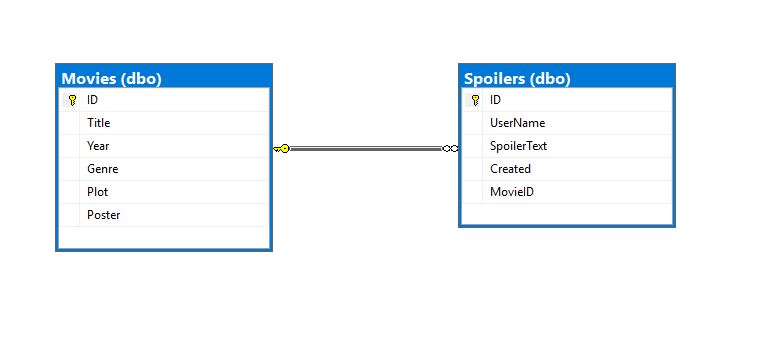

# Spoilt API

Spoilt API provides a database of movie spoilers with a 1-1 relationship to IMDB movie objects.
The API uses data from the OMDB api.

### Deployed
[http://spoiltapi.azurewebsites.net](http://spoiltapi.azurewebsites.net)

### Table of Contents

* [API Calls](#api-calls)
* [Database](#database)
* [Tools Used](#Tools Used)
* [Documentation](#documentation)
* [Contributors](#Contributors)
* [License](#license)


## API Calls
* List of Movies:
    * GET https://spoiltapi.azurewebsites.net/api/Movies
* Specific Movie:
    * GET https://spoiltapi.azurewebsites.net/api/Movies/{movieId}
* Search for Movie:
    * GET https://spoiltapi.azurewebsites.net/api/Movies/search?term={term}
* List of Spoilers:
    * GET https://spoiltapi.azurewebsites.net/api/Spoilers
* Specific Spoiler:
    * GET https://spoiltapi.azurewebsites.net/api/Spoilers/{spoilerId}
* Add a new spoilers
    * POST https://spoiltapi.azurewebsites.net/api/Spoilers
* Update a spoiler
    * PUT https://spoiltapi.azurewebsites.net/api/Spoilers/1


| HTTP METHOD | POST            | GET       | PUT         | DELETE |
| ----------- | --------------- | --------- | ----------- | ------ |
| CRUD OP     | CREATE          | READ      | UPDATE      | DELETE |
| /Movies       | Create new Movie | List Movies | ----------- | ----------- |
| /Movies/{id}  | -----------  | Get Movie   | If exists, update Movie; If not, error | ----------- |
| /Movies/search?term={term}       | ----------- | List Movies matching search term. | ----------- | ----------- |
| /Spoilers       | Create new Spoiler | List Spoilers | ----------- | ----------- |
| /Spoilers/{id}  | -----------  | Get Spoiler   | If exists, update Spoiler; If not, error | Delete Spoiler |


### Sample Endpoints
**GET: /api/Movies**
```json
[{
    "id": "string",
    "title": "string",
    "year": "string",
    "genre": "string",
    "plot": "string",
    "poster": "string",
    "spoilers": [
      {
        "id": 0,
        "userName": "string",
        "spoilerText": "string",
        "created": "2018-11-12T06:35:40.841Z",
        "movieID": "string"
      }
    ]
  }]```


**GET: /api/Movies/{imdbId}**
```json
{
	"id": "tt0097576",
	"title": "Indiana Jones and the Last Crusade",
	"year": "1989",
	"genre": "Action, Adventure, Fantasy",
	"plot": "In 1938, after his father Professor Henry Jones, Sr. goes missing while pursuing the Holy Grail, Indiana Jones finds himself up against Adolf Hitler's Nazis again to stop them obtaining its powers.",
	"poster": "https://m.media-amazon.com/images/M/MV5BMjNkMzc2N2QtNjVlNS00ZTk5LTg0MTgtODY2MDAwNTMwZjBjXkEyXkFqcGdeQXVyNDk3NzU2MTQ@._V1_SX300.jpg",
	"spoilers": [
	{
	"id": 2,
	"userName": null,
	"spoilerText": "He hates snakes. As always. And again.",
	"created": "2018-11-07T19:32:12.7933333",
	"movieID": "tt0097576"
	}]
	}
```

**GET: /api/Movies/search?term=indiana**
```json
{
	"name": null,
	"search": [
	{
	"title": "Indiana Jones and the Last Crusade",
	"year": "1989",
	"imdbID": "tt0097576",
	"type": "movie",
	"genre": "Action, Adventure, Fantasy",
	"poster": "https://m.media-amazon.com/images/M/MV5BMjNkMzc2N2QtNjVlNS00ZTk5LTg0MTgtODY2MDAwNTMwZjBjXkEyXkFqcGdeQXVyNDk3NzU2MTQ@._V1_SX300.jpg",
	"plot": "In 1938, after his father Professor Henry Jones, Sr. goes missing while pursuing the Holy Grail, Indiana Jones finds himself up against Adolf Hitler's Nazis again to stop them obtaining its powers."
	}],
	"response": true,
	"totalResults": 1,
	"error": null
}
```

**GET: /api/Spoilers**
```json
[{"id": 1,
"userName": "Stairmaster",
"spoilerText": "Bruce Willis was DEAD THE WHOLE TIME!!!!!",
"created": "0001-01-01T00:00:00",
"movieID": "tt0167404",
"movie": {
"id": "tt0167404",
"title": "The Sixth Sense",
"year": "1999",
"genre": "Drama, Thriller, Mystery",
"plot": "A boy who communicates with spirits seeks the help of a disheartened child psychologist.",
"poster": "https://m.media-amazon.com/images/M/MV5BMWM4NTFhYjctNzUyNi00NGMwLTk3NTYtMDIyNTZmMzRlYmQyXkEyXkFqcGdeQXVyMTAwMzUyOTc@._V1_SX300.jpg",
"spoilers": []
}
}]
```

**GET: /api/Spoilers**
```json
[{"id": 1,
"userName": "Stairmaster",
"spoilerText": "Bruce Willis was DEAD THE WHOLE TIME!!!!!",
"created": "0001-01-01T00:00:00",
"movieID": "tt0167404",
"movie": {
"id": "tt0167404",
"title": "The Sixth Sense",
"year": "1999",
"genre": "Drama, Thriller, Mystery",
"plot": "A boy who communicates with spirits seeks the help of a disheartened child psychologist.",
"poster": "https://m.media-amazon.com/images/M/MV5BMWM4NTFhYjctNzUyNi00NGMwLTk3NTYtMDIyNTZmMzRlYmQyXkEyXkFqcGdeQXVyMTAwMzUyOTc@._V1_SX300.jpg",
"spoilers": []
}
}]
```

**POST: /api/Spoilers**

Content:
```json
{
 "userName": "Stairmaster",
"spoilerText": "Bruce Willis was DEAD THE WHOLE TIME!!!!!",
"movieID": "tt0167404"
}
```
Success Response:
```json
[{"id": 1,
"userName": "Stairmaster",
"spoilerText": "Bruce Willis was DEAD THE WHOLE TIME!!!!!",
"created": "0001-01-01T00:00:00",
"movieID": "tt0167404",
"movie": {
"id": "tt0167404",
"title": "The Sixth Sense",
"year": "1999",
"genre": "Drama, Thriller, Mystery",
"plot": "A boy who communicates with spirits seeks the help of a disheartened child psychologist.",
"poster": "https://m.media-amazon.com/images/M/MV5BMWM4NTFhYjctNzUyNi00NGMwLTk3NTYtMDIyNTZmMzRlYmQyXkEyXkFqcGdeQXVyMTAwMzUyOTc@._V1_SX300.jpg",
"spoilers": []
}
}]
```

**PUT: /api/Spoilers/1**

Content:
```json
{
 "userName": "Stairmaster",
"spoilerText": "Bruce Willis was DEAD THE WHOLE TIME!!!!!",
"movieID": "tt0167404"
}
```
Success Response: No Response


## Database
The database is modeled to reflect a one to many relationship between Movies and Spoilers. A Movie can have many spoilers. The Movie object was modeled after the OBMD data properties that was considered necessary for the MVP. Since the application does not use any authentication/authorization no user tables were required.



Movie

		id	string  
		title	string
		year	string
		genre	string
		plot	string
		poster	string

Spoiler

	id*	integer($int32)
	userName	string
	spoilerText	string
	created*	string($date-time)
	movieID*	string

## Tools Used
- VSTS (Now Azure DevOps )
- Visual Studio
- Swagger

## Documentation
Documentation is provided by Swagger, and is available in the deployed website, or by running a local instance of the application.
[Deployed Swagger Docs](http://spoiltapi.azurewebsites.net)

## Contributors
- Guilherme Yazbek
- Kristofer Riedman 

## License
[MIT](SpoiltAPI/LICENSE)
